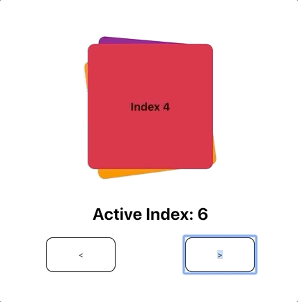
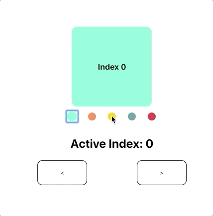

# react-pager

A fully controllable, high performance pager for React

<p align="center" style="display: flex; justify-content: center; align-items:center;">
  
  
</p>

### Install

`yarn add @crowdlinker/react-pager`

### Example

[CodeSandbox](https://codesandbox.io/s/floral-rgb-rko24)

```javascript
import React, { useState } from 'react';
import { Pager, PagerProvider } from '@crowdlinker/react-pager';
import { Slide } from './shared-components';

function MyPager() {
  const [activeIndex, onChange] = useState(1);

  return (
    <PagerProvider activeIndex={activeIndex} onChange={onChange}>
      <Pager>
        <Slide />
        <Slide />
        <Slide />
        <Slide />
      </Pager>
    </PagerProvider>
  );
}
```

### API Reference

### Pager

```typescript
import { Pager } from '@crowdlinker/react-pager';

interface PagerProps {
  type: 'horizontal' | 'vertical';
  children: React.ReactNode[];
  activeIndex?: number;
  onChange?: (nextIndex: number) => void;
  initialIndex?: number;
  adjacentChildOffset?: number;
  pageSize?: number;
  minIndex?: number;
  maxIndex?: number;
  threshold?: number;
  clamp: {
    next: number;
    prev: number;
  };
  clampDrag: {
    next: number;
    prev: number;
  };
  pageInterpolation: iInterpolationConfig;
  gestureOptions: Partial<GestureConfig>;
}
```

### PagerProvider

```typescript
import { PagerProvider } from '@crowdlinker/react-pager';

interface iPagerProvider {
  children: React.ReactNode;
  initialIndex?: number;
  activeIndex?: number;
  onChange?: (next: number) => void;
}
```

# Hooks

There are a number of useful hooks you can use in your screens when you wrap `<Pager />` in a `<PagerProvider />`

```typescript
  usePager(): [activeIndex, onChange]
  useFocus(): boolean -> is screen focused
  useOnFocus(fn) -> fn() to fire on screen focus
  useOffset() -> the animatedIndex of the page relative to the activeIndex
  useInterpolation(interpolationConfig) -> interpolated style object
```

### What is animatedIndex?

Animated index represents the animated value of the active index -- it includes possible intermediate values.
When panning or transitioning, the activeIndex value moves from 0 -> 1 but the animatedIndex value captures all intermediate values between 0 and 1 during this transition.

## Hooks in action

```javascript
function MySlide(props) {
  const [data, setData] = useState();

  useOnFocus(() => {
    if (!data) {
      myApi.fetchData(props).then(setData);
    }
  });

  const style = useInterpolation({
    transform: [
      {
        scale: {
          range: [-1, 0, 1],
          output: [0.9, 1, 0.9],
          extrapolate: 'clamp',
        },
      },
      {
        rotate: {
          unit: 'deg',
          range: [-1, 0, 1],
          output: [90, 0, 120],
        },
      },
    ],
  });

  return <animated.div style={{ flex: 1, ...style }}>...</animated.div>;
}
```

# Interpolation

One of the core features of this library is the ability to customize style transformations based on a screen's position relative to the focused screen.

Here is an example of an interpolation configuration:

```javascript
const scaledDown = {
  transform: [
    {
      scaleX: {
        range: [-1, 0, 1],
        output: [0.8, 1, 0.8],
        extrapolate: 'clamp',
      },
    },
  ],
};
```

The object itself is the same shape as any `style` prop you would normally pass into a `<Animated.View />` component. However, the values of these properties define an interpolation configuration.

The input range refers to the position relative to the focused screen:

```javascript
range: [-1, 0, 1];
// [-1] targets the screen before the focused screen
// [0] targets the screen that is focused
// [1] targets the screen after the focused screen
```

The output range reflects the style values that will be applied for each specified inputRange value:

```javascript
output: [0.8, 1, 0.8];
// [0.8] will be applied to the screen before the focused screen
// [1] will be applied to the screen that is focused
// [0.8] will be applied to the screen after the focused screen
```

In this case, screens that are on the left and right of the focused screen will be scaled to 80% of their size, and any screen outside of this range will also be given 80% scale.

You can customize the behaviour of all of the screens in a `<Pager />` by passing this configuration as the `pageInterpolation` prop. The interpolations can target all kinds of style properties, such as translations, rotations, and more.

Alternatively, you can customize styles for individual screens by using the `useInterpolation()` hook. This accepts the same configuration object, and will return the style property that you can apply to your `<animated.div>`

## Examples

More examples can be found on the react-native version of this library, here: https://github.com/CrowdLinker/react-native-pager. If you have any configurations you like, please feel free to share and we can update the examples! Cheers
